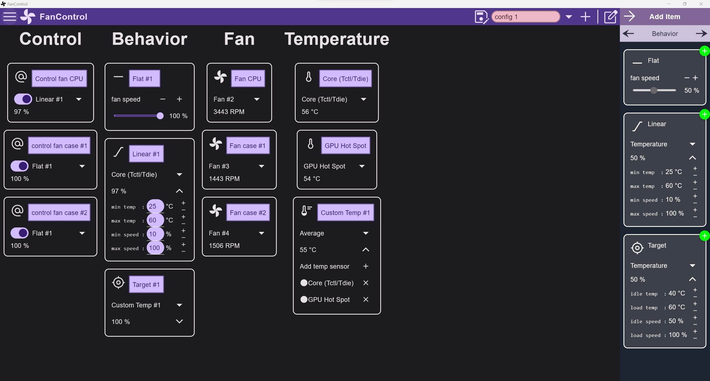

# LibreFanControl (Alpha)

------

## Notes
- Windows is currently the only supported OS.
- To support Linux, we must first implement an interface used in Kotlin. It might be easier than Windows because C++ is the only language required, and it's very easy to use it with Kotlin, but [lm-sensor](https://github.com/lm-sensors/lm-sensors) doesn't look like an easy-to-use library.
- High usage of RAM can be seen for now, but it will be improve in future update I hope.

## Feature
- Customize UI (data in real time, several kinds of items)
- Control fan (GPU fan don't work for now)
- Linear and Target behavior
- Custom sensor (average, max, ...)
- Save configuration

## Build
- You will need a JDK ([JDK 17](https://www.oracle.com/java/technologies/javase/jdk17-archive-downloads.html), [JDK 19](https://jdk.java.net/19/))
- Compile the library (`dotnet build` doesn't work for some reason, so you'll need an editor (I personally use Rider))
- `.\gradlew runDistributable` in FanControl folder
-  `.\gradlew packageReleaseMsi` to build the package (`remove_duplicate_libs.ps1` script may be useful to reduce the final size)

## Next steps

- [x] Publish
- [ ] Maybe change the way of fetching data, use a database instead
- [ ] Add tests
  - [ ] UI
  - [ ] Update
- [ ] Use expect/acutal functions of Kotlin instead of the current External interface
- [ ] Add workflow to the project (CI/CD, ect...)
- [ ] UI
  - [ ] Implement settings (info, help, launch at start up)
  - [ ] Add graph behavior (abscissa -> temp, ordinate -> fan speed)
  - [x] Add animations
- [ ] Support Linux
- [ ] Support Nvidia GPU
- [ ] Support water cooling

## Library used

#### UI
- [Compose Multiplatform Desktop](https://www.jetbrains.com/lp/compose-mpp/)
#### SENSORS
##### Windows
- [LibreHardwareMonitor](https://github.com/LibreHardwareMonitor/LibreHardwareMonitor)
- [Nvidia api wrapper](https://github.com/falahati/NvAPIWrapper)
##### Linux
- [lm-sensor](https://github.com/lm-sensors/lm-sensors)

  

Help to develop

 
  
> LibreHardwareMonitor [implementation](https://github.com/lich426/FanCtrl) in C#

> Github of [compose-desktop](https://github.com/JetBrains/compose-jb)

